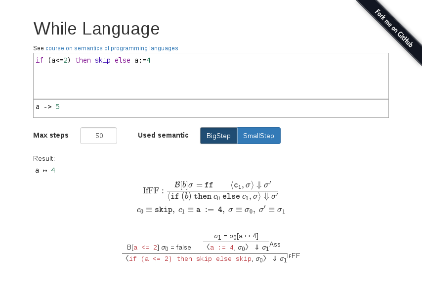
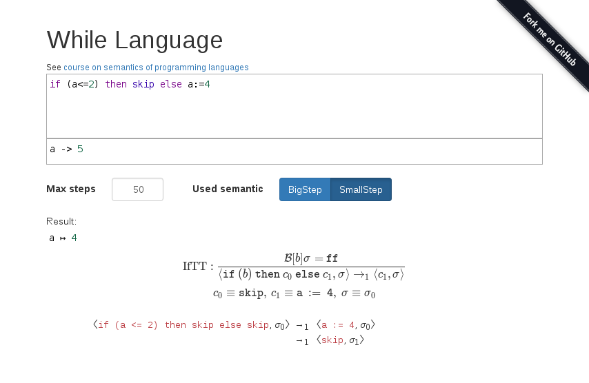

While-Semantics
=============

A visualization of evaluations of the while language via semantic rules.

See [course on semantics of programming languages](http://pp.info.uni-karlsruhe.de/lehre/SS2017/semantik/semantik-skript-2017.pdf)
for more information (in german) about the specific language.

Features
--------
- while language with scoped variable extension
- big step and small step evaluation
- draws nice evaluation trees
- shows information about the used rules
- syntax highlighting for code input via modified CodeMirror mode
- "sharing" of configurations via URLs
- many keyboard shortcuts to simplify the usage in lectures

Keyboard shortcuts
------------------

 Shortcut | Action
----------|------
 `e`      | Focus on the code editor
 `v`      | Focus on the context editor
 `m`      | Focus on the max steps input field
 `esc`    | Unfocus the previously focussed editor or input field (to apply the other shortcuts again)
 `s`      | Toggle between big and small step evaluation
 `+`/`-`  | Increase/decrease the maximum number of allowed steps
 `p`      | Toggle the popups in the evaluation visualization
 

License
-------
MIT