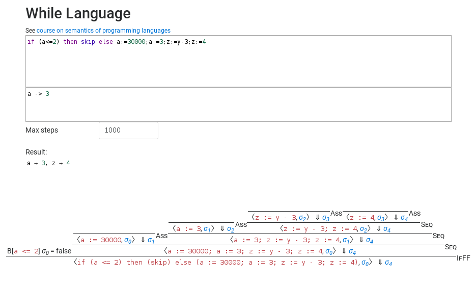

WhileSemantic
=============

A visualization of evaluations of the while language via semantic rules.

See [course on semantics of programming languages](http://pp.info.uni-karlsruhe.de/lehre/SS2017/semantik/semantik-skript-2017.pdf)
for more information (in german) about the specific language.

Features
--------
- while language with scoped variable extension
- big step evaluation
- draws nice evaluation trees
- syntax highlighting for code input via modified CodeMirror mode

License
-------
MIT